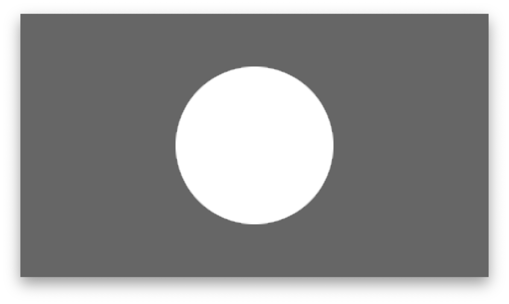
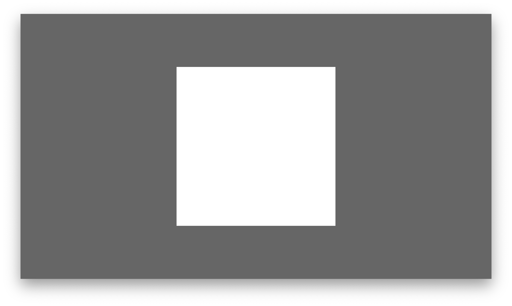
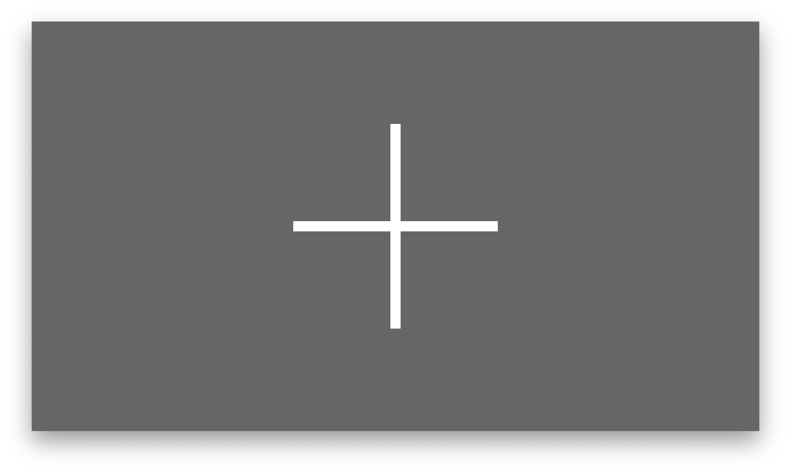
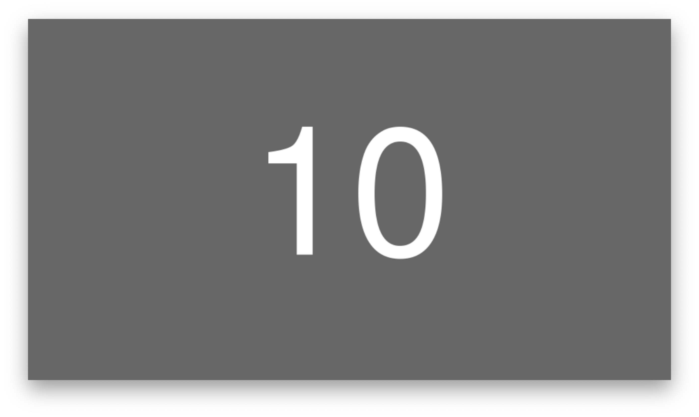
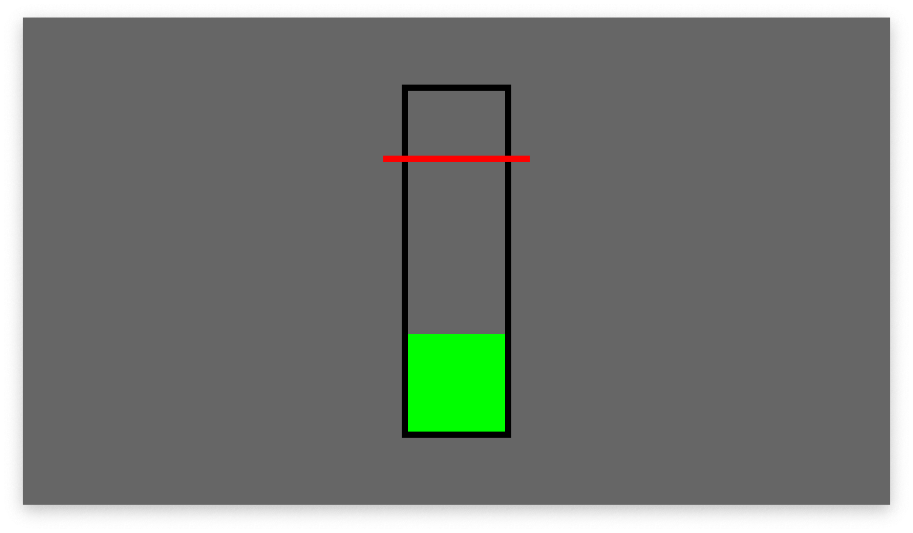
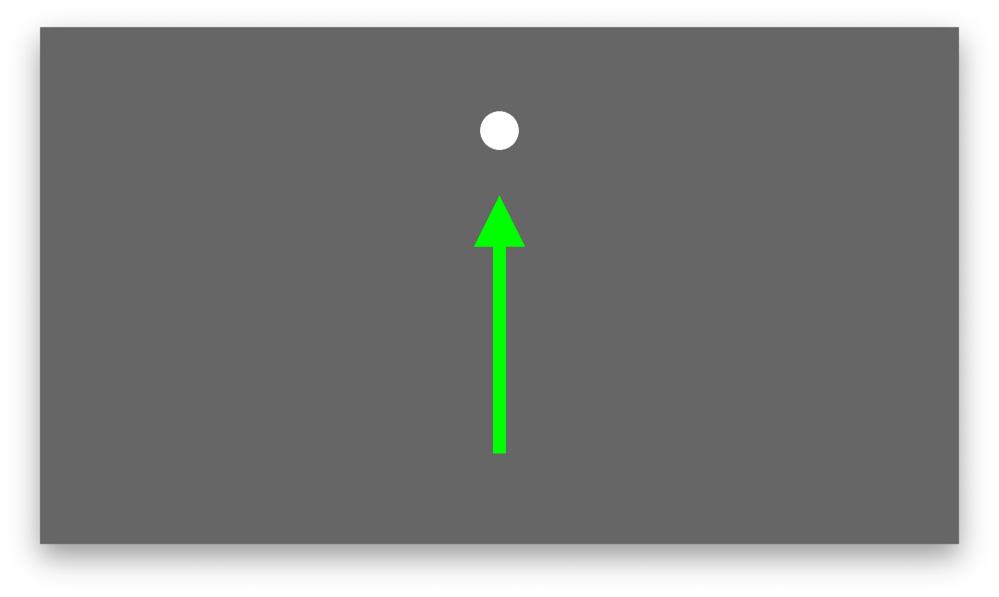
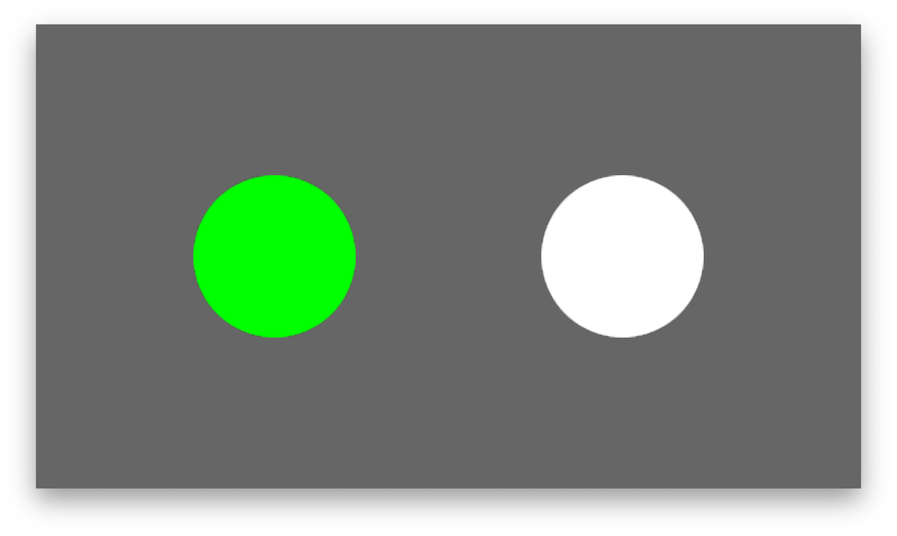
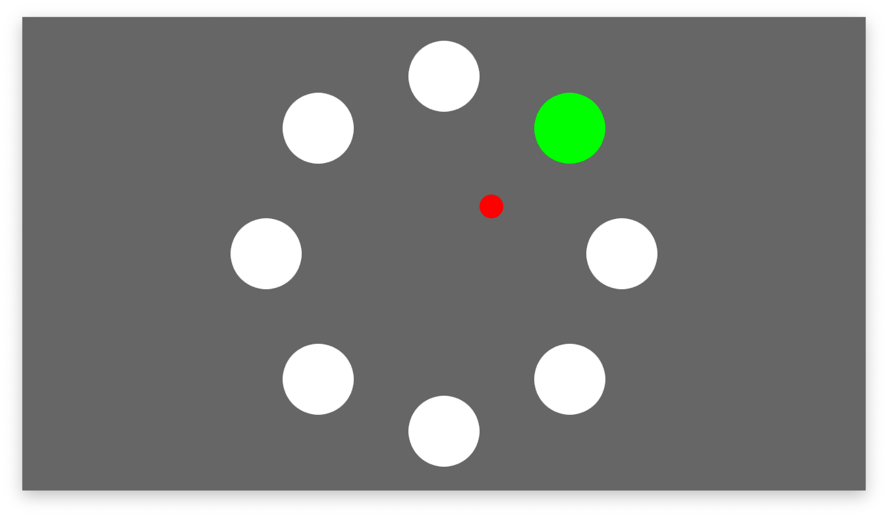

# Paradigm Scripting

## Introduction

The paradigm is programmed via a so-called _paradigm file_. A paradigm file contains regular Python code and must define the **Paradigm class**, which must derive from the **ParadigmBase parent class**. Its code is automatically loaded when YAGA starts. A typical skeleton looks like this:

```
from yaga_modules.paradigm_base import ParadigmBase
import yaga_modules.graphic_objects as GO
import yaga_modules.audio_objects as AO
import yaga_modules.signal_processing as SP

class Paradigm(ParadigmBase):
    def __init__(self, paradigm_variables):
        super().__init__(paradigm_variables)
        […]
```

### Creation of a Presentation Objects

YAGA supports the timed presentation of several graphical or auditory objects, e.g., text, circles, or beep tones. A presentation object needs to be created within the **\_\_init\_\_** constructor of the **Paradigm class** and registered to YAGA. A simple text object can be created as:

```info_text = self.registerObject(GO.Text('prepare for task'))```

In this example, **GO.Text** refers to the **Text class** defined in the **graphic_objects module** (GO). The call of **registerObject** is obligatory and registers the object to YAGA.

### Timing of Presentation Objects

Once an object has been created and registered, state changes of the object can be scripted, i.e., timed. For that purpose, the **ParadigmBase parent class** provides the instance variable **script**. **script** must be a list of **ScriptItem** objects.

A **ScripItem** object specifies:

1. a list of actions to execute when triggered
2. the trigger (time, signal or LSL event marker)
3. an informative name which is sent as an LSL event marker when the **ScriptItem** is triggered

### Demo Paradigm

The paradigm _demo.py_ implements a simple paradigm where study participants execute a task after a Go cue. The paradigm shows an information text and a traffic light on the screen. The traffic light represents the Go cue, after which a countdown starts. While the countdown is running, the study participants would be asked to execute a specific task. The demo paradigm file shows the creation of the text, traffic light images, and countdown objects.

A trial comprises the following script items: _“trial_start”_, _“info_text”_, _“traffic_ligh_red”_, _“traffic_ligh_yellow”_, _“traffic_ligh_green”_, _“countdown”_, _“trial_end”_, which are sequentially executed. Each script item specifies optionally the actions to execute when the script item is triggered. Note that the actions must be specified as objects instead of as actual method calls (i.e., no parentheses). The **script** list contains in total 5 (TODO) trial sequences, which are built using a for loop.

The demo paradigm file demonstrates 3 possible trigger types: **absolute time**, **relative time**, and **signal-based**. An absolute time trigger is used by the first _“trial_start”_ script item, which is triggered 5s after the program start. However, the subsequent _“trial_start”_ script items are triggered relative to the previous _“trial_end”_ script item within a random time interval (5-10s). A relative time trigger can be requested by setting the **time_type** property to **rel** and the **rel_name** property to the name of the referenced script item. The signal-based trigger is used by the _“trial_end”_ script item. This script item is triggered when the countdown object elicits the **COUNTDOWN_FINISHED** signal as specified by the _“wait_for_signal”_ property.

Full source code of the demo paradigm file:

```
TODO
```

## Script Items

The paradigm sequence is defined by _script items_, which must be listed in the **script** instance variable of your **Paradigm** class. The script items are processed one by one in the order in which they appear in the instance variable **script**. A script item can be triggered by a **time event**, by a **signal event** generated by a graphical object, or by an external **LSL marker event**. You can also combine different trigger types. The script item is then triggered by whichever event comes first. A script item can be defined as:

```ScriptItem(name='trial_start', time=10, actions=[info_text.activate])```

In this example, the script item will call the method **activate** on the graphical object **info_text** at second 10 after the program start.

The name of the script item is sent as an event marker in the LSL stream _yaga_ when the item is triggered. This allows recording programs to save the paradigm state together with the LSL data streams (see [Integration with LSL](integration_with_lsl.md)).

Note that the execution of script items is synchronised to the screen refresh rate (often 60 Hz).

### Actions

The actions parameter of a **ScriptItem** expects a list of methods which are called when the action item is triggered. The available actions depend on the presentation object and are listed in [Supported Graphical Objects](paradigm_scripting.md#supported-graphical-objects) and [Auditory Objects](paradigm_scripting.md#auditory-objects).

The actions must be specified as objects and not as method calls, i.e., without subsequent parentheses. This is to ensure that actions are executed when the script item is triggered and not at the program start when the initialisation method is executed.

Some actions accept parameters. You can specify parameters by using the **partial function** from the **functools module**. The **partial function** allows to fix arguments and generates a new function object. This new function object is then executed when the action item is triggered.

First import **partial**:

`from functools import partial`

Then use **partial** to create a new function object with a fixed set of parameters, e.g.:

`ScriptItem(name='trial_start', time=10, actions=[targets.activate, partial(targets.setActiveTarget, 1)])`

In this example, **targets.setActiveTarget(1)** is executed when the script item is triggered.

### Time Triggers

YAGA supports two types of time triggers: **absolute time triggers** and **relative time triggers**. A trigger specified with an absolute time is triggered at the specified time after the program start. A trigger specified with a relative time is triggered at the specified time relative to another script item.

An absolute time trigger is the default. For example, to trigger a script item 10s after the program start, write:

`ScriptItem(name='trial_start', time=10, actions=[info_text.activate])`

To specify a relative time trigger, set _time_type_ to _“rel”_ and provide the name of the reference event with _rel_name_. For example, to trigger a script item 5s to 10s after the last “trial_end” event, write:

`ScriptItem(name='trial_start', time=np.random.uniform(5, 10), time_type='rel', rel_name='trial_end', actions=[info_text.activate\])]`

### Signal Triggers

A script item can wait for trigger signals generated by graphical objects. To trigger a script item with a signal, set _wait_for_signal_ to the respective signal. The possible trigger signals are listed in [Supported Graphical Objects](paradigm_scripting.md#supported-graphical-objects). For example:

`ScriptItem(name='trial_end', wait_for_signal=GO.Countdown.COUNTDOWN_FINISHED, actions=[])`

### LSL Event Marker Triggers

A script item can be triggered by an external _LSL event marker_ generated by other programs. To listen to an LSL event marker stream, call the method **listenForLSLMarkers** in the paradigm file. For example, to listen for markers in the first channel of the stream _streamA_:

`self.listenForLSLMarkers("streamA", lsl_marker_channel=0)`

The streams are expected to be event marker streams, i.e., they have an irregular sampling rate. The markers are usually variable-length ASCII strings.

After setting up an LSL event listener, you can trigger script items on LSL events by specifying the marker with the parameter _wait_for_lsl_marker_. For example:

`ScriptItem(name='trial_end', wait_for_lsl_marker=”target_reached”, actions=[])`

The data type of the specified marker must correspond to the data type of the LSL stream (usually a _string_).

## Command Line Variables

YAGA supports three general-purpose variables, which can be specified when you start YAGA.py (_var1_, _var2_, _var3_). For example:

`python yaga.py --paradigm YOURPARADIGM --var1 someStringOrNumber`

The general purpose variables are accessible in the paradigm file:

```
class Paradigm(ParadigmBase):

    def __init__(self, paradigm_variables):

        var1 = paradigm_variables['var1']
```

Moreover, one can specify the subject code (_string_) and session number (_integer_) with the command line parameters `--subject` and `--session`, respectively. These parameters are accessible as `paradigm_variables['subject']` and `paradigm_variables['session']` in the paradigm file.

## Graphical Objects

Graphical objects are objects shown on the computer screen, such as text or feedback bars. They can be [controllable](paradigm_scripting.md#control-of-graphical-objects) with LSL streams, and can feature animations.

To use graphical objects, one needs to import the **graphic_objects module** first:

`import yaga_modules.graphic_objects as GO`

A graphical object must be created in the initialisation method of the paradigm file and registered to YAGA. For example, to create a text object:

`text = self.registerObject(GO.Text('prepare for task'))`

### Base Methods

All graphical objects support the following methods which can be specified as actions in a **ScriptItem**:

| method     | parameters | value type | description           |
|------------|------------|------------|-----------------------|
| activate   | \-         | \-         | show object on screen |
| deactivate | \-         | \-         | hide object on screen |

The position, scale, angle, and color of graphical objects can be changed with the following methods:

| method      | parameters          | value types             | description                |
|-------------|---------------------|-------------------------|----------------------------|
| updatePos   | pos_x, pos_y, depth | double, double, integer | set x/y position and depth |
| updateScale | scale_x, scale_y    | double, double          | set x/y size               |
| updateRot   | angle               | double                  | rotate object (in degrees) |
| updateColor | color               | string or 3-tuple       | set color                  |

### Screen Coordinates

The screen coordinates are independent of the monitor resolution. The centre of the screen corresponds to the x/y position 0. The bottom edge corresponds to a y position of -1. The top edge corresponds to an y position of 1. The coordinates of the left and right edges depend on the screen ratio. With a typical screen ratio of 16:9, the left and right edges have the x coordinate -1.78 and 1.78, respectively ((y<sub>top</sub> - y<sub>center</sub>) x 16/9).

### Depth of Objects

The depth parameter must be an integer value and specifies the depth position of objects. Objects with a smaller depth value are in front of objects with a higher depth value (the default depth is 0).

### Colour of Objects

Many objects allow changing their colour. The colour must be specified as an RGB tuple with values from (0, 0, 0) to (255, 255, 255) or as a colour name (_string_). The following color names are supported: _black, white, red, lime, blue, yellow, cyan, magenta, silver, gray, maroon, olive, green, purple, teal, navy, gold, orange,_ and _darkorange_.

### Animated Objects

Some graphical objects support animations. Animations can be started or stopped using an action (**startAnimation**, **stopAnimation**) in a **ScriptItem**. Furthermore, animations can generate signals which can be used as triggers for **ScriptItems** (e.g., trigger actions at the end of an animation).

### Supported Graphical Objects

Typical graphical elements used in neuroscience experiments are implemented. The Python classes representing these elements are described in the following.

#### Image Class

Loads an image file from the hard disk and displays it on the computer screen. All common image formats are supported.

_Object Initialisation Parameters:_

| parameter | value type | description         |
|-----------|------------|---------------------|
| file      | string     | file name of image  |
| pox_x     | double     | horizontal position |
| pos_y     | double     | vertical position   |
| depth     | integer    | depth position      |
| scale_x   | double     | horizontal size     |
| scale_y   | double     | vertical size       |
| angle     | double     | rotation angle      |

#### Ball Class

Displays a filled circle on the computer screen.



_Object Initialisation Parameters:_

| parameter | value type        | description         |
|-----------|-------------------|---------------------|
| pox_x     | double            | horizontal position |
| pos_y     | double            | vertical position   |
| depth     | integer           | depth position      |
| scale_x   | double            | horizontal size     |
| scale_y   | double            | vertical size       |
| color     | string or 3-tuple | fill color          |

#### Box Class

Displays a filled box on the computer screen.



_Object Initialisation Parameters:_

| parameter | value type        | description         |
|-----------|-------------------|---------------------|
| pox_x     | double            | horizontal position |
| pos_y     | double            | vertical position   |
| depth     | integer           | depth position      |
| scale_x   | double            | horizontal size     |
| scale_y   | double            | vertical size       |
| angle     | double            | rotation angle      |
| color     | string or 3-tuple | fill color          |

#### Cross Class

Displays a cross on the screen.



_Object Initialisation Parameters:_

| parameter  | value type        | description         |
|------------|-------------------|---------------------|
| line_width | double            | cross line size     |
| pox_x      | double            | horizontal position |
| pos_y      | double            | vertical position   |
| depth      | integer           | depth position      |
| scale_x    | double            | horizontal size     |
| scale_y    | double            | vertical size       |
| angle      | double            | rotation angle      |
| color      | string or 3-tuple | cross color         |

#### Text Class

Displays a text box on the computer screen. Optionally, a value can be read from an LSL stream and displayed on the screen as a rounded number.


To read a number from an LSL stream, call the method _controlStateWithLSLStream_. For example:

```
text = self.registerObject(GO.Text())
text.controlStateWithLSLStream(“the-stream”, channels=[1])
```

_Object Initialisation Parameters:_

| parameter        | value type        | description               |
|------------------|-------------------|---------------------------|
| text             | string            | text to display           |
| pox_x            | double            | horizontal position       |
| pos_y            | double            | vertical position         |
| depth            | integer           | depth position            |
| scale_x          | double            | horizontal size           |
| scale_y          | double            | vertical size             |
| angle            | double            | rotation angle            |
| color            | string or 3-tuple | text color                |
| background_color | string or 3-tuple | text box background color |
| frame_color      | string or 3-tuple | text box frame color      |

*ScriptItem Actions:*

| method                | parameters | value types       | description                   |
|-----------------------|------------|-------------------|-------------------------------|
| updateColor           | color      | string or 3-tuple | set text color                |
| updateBackgroundColor | color      | string or 3-tuple | set text box background color |
| updateFrameColor      | color      | string or 3-tuple | set text box frame color      |
| updateText            | text       | string            | set text                      |

#### RandomNumber Class

Display a random number in a text box on the computer screen. The number is updated after each call of the method **activate** according to a discrete normal distribution.



_Object Initialisation Parameters:_

| parameter        | value type         | description                                                 |
|------------------|--------------------|-------------------------------------------------------------|
| interval         | list of 2 integers | a random number is drawn from the specified closed interval |
| pox_x            | double             | horizontal position                                         |
| pos_y            | double             | vertical position                                           |
| depth            | integer            | depth position                                              |
| scale_x          | double             | horizontal size                                             |
| scale_y          | double             | vertical size                                               |
| angle            | double             | rotation angle                                              |
| color            | string or 3-tuple  | text color                                                  |
| background_color | string or 3-tuple  | text box background color; set to None to deactivate        |
| frame_color      | string or 3-tuple  | text box frame color; set to None to deactivate             |

#### Countdown Class

An animated countdown is displayed in a text box on the computer screen. The countdown is restarted after each call of the method **activate**.


_Object Initialisation Parameters:_

| parameter        | value type        | description                    |
|------------------|-------------------|--------------------------------|
| counter_start    | integer           | initial value of the countdown |
| counter_stop     | integer           | final value of the countdown   |
| counter_interval | double            | interval time in seconds       |
| pox_x            | double            | horizontal position            |
| pos_y            | double            | vertical position              |
| depth            | integer           | depth position                 |
| scale_x          | double            | horizontal size                |
| scale_y          | double            | vertical size                  |
| angle            | double            | rotation angle                 |
| color            | string or 3-tuple | text color                     |
| background_color | string or 3-tuple | text box background color      |
| frame_color      | string or 3-tuple | text box frame color           |

*ScriptItem Trigger Signals:*

| signal                       | description                          |
|------------------------------|--------------------------------------|
| Countdown.COUNTDOWN_FINISHED | elicited at the end of the countdown |

#### Bar Class

Displays a bar for 1D feedback on the screen. The fill level of the bar is controlled with a channel from an LSL stream. Optionally, a horizontal target line can be specified. The target line position can be fixed at object initialization, updated with a call of **updateTargetValue**, or controlled with an LSL stream. If the target is controlled with an LSL stream, the target position can be continuously updated (see parameter _target_online_control_) or updated at discrete time points with the action **updateTargetValueFromLSLStream**.



To set up the control of the fill level, call the method **controlStateWithLSLStream** and specify one control channel. For example:

```
bar = self.registerObject(GO.Bar(pos_x=0, pos_y=0))
bar.controlStateWithLSLStream(“the-stream”, channels=[0])
```

To optionally control the vertical target position continuously with the same LSL stream, set _target_online_control_ to _true_, and specify a second control channel. For example:

```
bar = self.registerObject(GO.Bar(pos_x=0, pos_y=0, target_online_control=true))
bar.controlStateWithLSLStream(“the-stream”, channels=[0, 1])
```

The vertical target position can also be controlled with a separate LSL stream by using **controlStateWithLSLStream<u>s</u>**. The second specified channel then refers to the second stream. For example:

```
bar = self.registerObject(GO.Bar(pos_x=0, pos_y=0, target_online_control=true))
bar.controlStateWithLSLStream([“stream-A”, "stream-B"], channels=[0, 1])
```

Instead of continuously updating the target position from an LSL stream, the target position can also be updated when a script item is triggered. This can be achieved by specifying the action **updateTargetValueFromLSLStream** in the respective **ScriptItem** objects. Note that you still need to set up the control with **controlStateWithLSLStream** or **controlStateWithLSLStreams**.
For example:

```
bar = self.registerObject(GO.Bar(pos_x=0, pos_y=0, target_online_control=false))
bar.controlStateWithLSLStream(“the-stream”, channels=[0, 1])

[...]

ScriptItem(name='update_bar', time=10, actions=[bar.updateTargetValueFromLSLStream])
```

_Object Initialisation Parameters:_

| parameter             | value type        | description                                                                                                               |
|-----------------------|-------------------|---------------------------------------------------------------------------------------------------------------------------|
| pox_x                 | double            | horizontal position                                                                                                       |
| pos_y                 | double            | vertical position                                                                                                         |
| depth                 | integer           | depth position                                                                                                            |
| bar_width             | double            | width of the bar                                                                                                          |
| bar_height            | double            | height of the bar when fully raised                                                                                       |
| frame_width           | double            | thickness of the frame around the bar                                                                                     |
| target_width          | double            | width of the target line                                                                                                  |
| target_height         | double            | height of the target line                                                                                                 |
| bar_color             | string or 3-tuple | color of the bar                                                                                                          |
| frame_color           | string or 3-tuple | color of the bar frame                                                                                                    |
| target_color          | string or 3-tuple | color of the target line                                                                                                  |
| low_value             | double            | LSL value corresponding to an empty bar                                                                                   |
| high_value            | double            | LSL value corresponding to a fully filled bar                                                                             |
| target_value          | double            | - target value or fill level (_low_value_ <= target <= _high_value_) <br> - if set to _None_, no target will be displayed |
| target_online_control | bool              | - if _true_ control the vertical target position continuously with an LSL stream <br> - a second control channel for the target position must be specified when calling **controlStateWithLSLStream** or **controlStateWithLSLStreams** <br> - if _false_, the target position can be updated with the action **updateTargetValueFromLSLStream** |

*ScriptItem Actions:*

| method                         | parameters   | value types | description                                                                                                                                    |
|--------------------------------|--------------|-------------|------------------------------------------------------------------------------------------------------------------------------------------------|
| updateTargetValue              | target_value | double      | update the target value                                                                                                                        |
| updateTargetValueFromLSLStream | -            | -           | - update the target value with the most recent value from an LSL stream <br> - it is necessary to call **controlStateWithLSLStream(s)** before |

#### BarWithRampTarget Class

Displays a feedback [bar]](paradigm_scripting.md#bar-class) with a ramp animation of the target. The target will transit through the following phases:

1.  pre phase: target line is at the initial position
2.  ramp up phase: target line moves upwards
3.  hold phase: target line is at the hold position
4.  ramp down phase: target line moves downwards
5.  post phase: target line is back to the initial position

An additional horizontal line indicating the final ramp target will be displayed (target information) if the target animation is configured to stop below the top of the bar.

_Object Initialisation Parameters:_

| parameter                | value type        | description                                       |
|--------------------------|-------------------|---------------------------------------------------|
| pox_x                    | double            | horizontal position                               |
| pos_y                    | double            | vertical position                                 |
| depth                    | integer           | depth position                                    |
| bar_width                | double            | width of the bar                                  |
| bar_height               | double            | height of the bar when fully raised               |
| frame_width              | double            | thickness of the frame around the bar             |
| target_width             | double            | width of the target line                          |
| target_height            | double            | height of the target line                         |
| bar_color                | string or 3-tuple | color of the bar                                  |
| frame_color              | string or 3-tuple | color of the bar frame                            |
| target_color             | string or 3-tuple | color of the target line                          |
| target_info_color        | string or 3-tuple | color of the target information                   |
| pre_phase_duration       | double            | time duration of the pre phase                    |
| ramp_up_phase_duration   | double            | time duration of the ramp up phase                |
| hold_phase_duration      | double            | time duration of the hold phase                   |
| ramp_down_phase_duration | double            | time duration of the ramp down phase              |
| post_phase_duration      | double            | time duration of the post phase                   |
| low_value                | double            | LSL value corresponding to a fully contracted bar |
| high_value               | double            | LSL value corresponding to a fully raised bar     |
| start_value              | double            | the initial position of the target                |
| ramp_value               | double            | the position of the target in the hold phase      |

*ScriptItem Actions:*

| method            | parameters   | value types | description             |
|-------------------|--------------|-------------|-------------------------|
| updateTargetValue | target_value | double      | update the target value |
| startAnimation    | \-           | \-          | start ramp animation    |
| stopAnimation     | \-           | \-          | stop ramp animation     |

*ScriptItem Trigger Signals:*

| signal                         | description                              |
|--------------------------------|------------------------------------------|
| BarWithRampTarget.BAR_FINISHED | elicited after the end of the post phase |

#### BarWithSinusTarget Class

Displays a feedback [bar](paradigm_scripting.md#bar-class) with a sinus oscillation animation of the target. The target will transit through the following phases:

1.  pre phase: target line is at the initial position
2.  ramp up phase: target line moves upwards
3.  sinus phase: target line oscillates up and down
4.  ramp down phase: target line moves downwards
5.  post phase: target line is back to the initial position

An additional horizontal line indicating the oscillation center will be displayed (target information) if the oscillation center is configured to be below the top of the bar.

_Object Initialisation Parameters:_

| parameter                | value type        | description                                       |
|--------------------------|-------------------|---------------------------------------------------|
| pox_x                    | double            | horizontal position                               |
| pos_y                    | double            | vertical position                                 |
| depth                    | integer           | depth position                                    |
| bar_width                | double            | width of the bar                                  |
| bar_height               | double            | height of the bar when fully raised               |
| frame_width              | double            | thickness of the frame around the bar             |
| target_width             | double            | width of the target line                          |
| target_height            | double            | height of the target line                         |
| bar_color                | string or 3-tuple | color of the bar                                  |
| frame_color              | string or 3-tuple | color of the bar frame                            |
| target_color             | string or 3-tuple | color of the target line                          |
| target_info_color        | string or 3-tuple | color of the target information                   |
| pre_phase_duration       | double            | time duration of the pre phase                    |
| ramp_up_phase_duration   | double            | time duration of the ramp up phase                |
| sinus_phase_duration     | double            | time duration of the oscillation phase            |
| sinus_frequency          | double            | oscillation frequency in Hz                       |
| sinus_amplitude          | double            | oscillation amplitude                             |
| ramp_down_phase_duration | double            | time duration of the ramp down phase              |
| post_phase_duration      | double            | time duration of the post phase                   |
| low_value                | double            | LSL value corresponding to a fully contracted bar |
| high_value               | double            | LSL value corresponding to a fully raised bar     |
| start_value              | double            | the initial position of the target                |
| ramp_value               | double            | the center position of the sinus oscillations     |

*ScriptItem Actions:*

| method            | parameters   | value types | description             |
|-------------------|--------------|-------------|-------------------------|
| updateTargetValue | target_value | double      | update the target value |
| startAnimation    | \-           | \-          | start ramp animation    |
| stopAnimation     | \-           | \-          | stop ramp animation     |

*ScriptItem Trigger Signals:*

| signal                          | description                              |
|---------------------------------|------------------------------------------|
| BarWithSinusTarget.BAR_FINISHED | elicited after the end of the post phase |

#### Arrow Class

Displays an arrow for 2D feedback on the computer screen. The endpoint of the arrow is controlled with two channels from an LSL stream. Optionally, a target can be visualised as a disk above the arrow's origin. The vertical target position can be fixed at object initialization, updated with a call of **updateTargetValue**, or controlled with an LSL stream. If the target is controlled with an LSL stream, the target position can be continuously updated (see parameter _target_online_control_) or updated at discrete time points with the action **updateTargetValueFromLSLStream**.



To set up the control of the arrow’s endpoint, call the method **controlStateWithLSLStream** and specify the LSL stream and two control channels. For example:

```
arrow = self.registerObject(GO.Arrow(pos_x=0, pos_y=0))
arrow.controlStateWithLSLStream(“the-stream”, channels=[0, 1])
```

To optionally control the vertical target position continuously with the same LSL stream, set _target_online_control_ to _true_, and specify a third control channel. For example:

```
arrow = self.registerObject(GO.Arrow(pos_x=0, pos_y=0, target_online_control=true))
arrow.controlStateWithLSLStream(“the-stream”, channels=[0, 1, 2])
```

The vertical target position can also be controlled with a separate LSL stream by using **controlStateWithLSLStream<u>s</u>**. The third specified channel then refers to the second stream. For example:

```
arrow = self.registerObject(GO.Arrow(pos_x=0, pos_y=0, target_online_control=true))
arrow.controlStateWithLSLStreams([“stream-A”, "stream-B"], channels=[0, 1, 0])
```

Instead of continuously updating the target position from an LSL stream, the target position can also be updated when a script item is triggered. This can be achieved by specifying the action **updateTargetValueFromLSLStream** in the respective **ScriptItem** objects. Note that you still need to set up the control with **controlStateWithLSLStream** or **controlStateWithLSLStreams**.
For example:

```
arrow = self.registerObject(GO.Arrow(pos_x=0, pos_y=0, target_online_control=false))
arrow.controlStateWithLSLStream(“the-stream”, channels=[0, 1, 2])

[...]

ScriptItem(name='update_arrow', time=10, actions=[arrow.updateTargetValueFromLSLStream])
```


_Object Initialisation Parameters:_

| parameter             | value type        | description                                                                                    |
|-----------------------|-------------------|------------------------------------------------------------------------------------------------|
| pox_x                 | double            | horizontal position                                                                            |
| pos_y                 | double            | vertical position                                                                              |
| depth                 | integer           | depth position                                                                                 |
| angle                 | double            | rotation angle of the arrow                                                                    |
| arrow_length          | double            | length of the arrow when fully extended                                                        |
| line_width            | double            | width of the arrow                                                                             |
| head_size             | double            | head size of the arrow                                                                         |
| target_size           | double            | size of the target                                                                             |
| arrow_color           | string or 3-tuple | color of the arrow                                                                             |
| target_color          | string or 3-tuple | color of the target                                                                            |
| low_value             | double            | LSL value corresponding to a fully contracted arrow                                            |
| high_value            | double            | LSL value corresponding to a fully extended arrow                                              |
| target_value          | double            | - target value (vertical target position) <br> - if set to _None_, no target will be displayed |
| target_online_control | bool              | - if _true_, control the vertical target position continuously with an LSL stream <br> - a third control channel for the target position must be specified when calling **controlStateWithLSLStream** or **controlStateWithLSLStreams** <br> - if _false_, the target position can be updated with the action **updateTargetValueFromLSLStream** |

*ScriptItem Actions:*

| method                         | parameters   | value types | description                                                                                                                                     |
|--------------------------------|--------------|-------------|-------------------------------------------------------------------------------------------------------------------------------------------------|
| updateTargetValue              | target_value | double      | update the target value                                                                                                                         |
| updateTargetValueFromLSLStream | -            | -           | - update the target value with the most recent value from an LSL stream <br> - it is necessary to call **controlStateWithLSLStream(s)*** before |

#### ArrowWithRampTarget Class

Displays a feedback [arrow](paradigm_scripting.md#arrow-class) with a ramp animation of the target disk. The target will transit through the following phases:

1.  pre phase: target disk is at the initial position
2.  ramp up phase: target disk moves upwards
3.  hold phase: target disk is at the final position
4.  ramp down phase: target disk moves downwards
5.  post phase: target disk is back to the initial position

An additional disk indicating the final ramp target position will be displayed (target information).

_Object Initialisation Parameters:_

| parameter                | value type        | description                                                                                                                                       |
|--------------------------|-------------------|---------------------------------------------------------------------------------------------------------------------------------------------------|
| pox_x                    | double            | horizontal position                                                                                                                               |
| pos_y                    | double            | vertical position                                                                                                                                 |
| depth                    | integer           | depth position                                                                                                                                    |
| angle                    | double            | rotation angle                                                                                                                                    |
| arrow_length             | double            | length of the arrow when fully extended                                                                                                           |
| line_width               | double            | width of the arrow                                                                                                                                |
| head_size                | double            | head size of the arrow                                                                                                                            |
| target_size              | double            | size of the target                                                                                                                                |
| target_info_size         | double            | size of the target information                                                                                                                    |
| arrow_color              | string or 3-tuple | color of the arrow                                                                                                                                |
| target_color             | string or 3-tuple | color of the target                                                                                                                               |
| target_info_color        | string or 3-tuple | color of the target information                                                                                                                   |
| pre_phase_duration       | double            | time duration of the pre phase                                                                                                                    |
| ramp_up_phase_duration   | double            | time duration of the ramp up phase                                                                                                                |
| hold_phase_duration      | double            | time duration of the hold phase                                                                                                                   |
| ramp_down_phase_duration | double            | time duration of the ramp down phase                                                                                                              |
| post_phase_duration      | double            | time duration of the post phase                                                                                                                   |
| low_value                | double            | LSL value corresponding to a fully contracted arrow                                                                                               |
| high_value               | double            | LSL value corresponding to a fully extended arrow                                                                                                 |
| start_value              | double            | the initial position of the target                                                                                                                |
| ramp_value               | double            | - the center position of the sinus oscillation <br> - when this value is lower than the _high_value_, an additional hold target will be displayed |

*ScriptItem Actions:*

| method            | parameters   | value types | description             |
|-------------------|--------------|-------------|-------------------------|
| updateTargetValue | target_value | double      | update the target value |
| startAnimation    | -            | -           | start ramp animation    |
| stopAnimation     | -            | -           | stop ramp animation     |

*ScriptItem Trigger Signals:*

| signal                                 | description                              |
|----------------------------------------|------------------------------------------|
| ArrowWithRampTarget.BAR_ARROW_FINISHED | elicited after the end of the post phase |

#### ArrowWithSinusTarget Class

Displays a feedback [arrow Class](paradigm_scripting.md#arrow-class) with a ramp animation of the target disk. The target will transit through the following phases:

1.  pre phase: target disk is at the initial position
2.  ramp up phase: target disk moves upwards
3.  sinus phase: target disk is oscillating up & down
4.  ramp down phase: target disk moves downwards
5.  post phase: target disk is back to the initial position

An additional disk indicating the position of the oscillation centre will be displayed (target information).

_Object Initialisation Parameters:_

| parameter                | value type        | description                                                                                                                                       |
|--------------------------|-------------------|---------------------------------------------------------------------------------------------------------------------------------------------------|
| pox_x                    | double            | horizontal position                                                                                                                               |
| pos_y                    | double            | vertical position                                                                                                                                 |
| depth                    | integer           | depth position                                                                                                                                    |
| angle                    | double            | rotation angle                                                                                                                                    |
| arrow_length             | double            | length of the arrow when fully extended                                                                                                           |
| line_width               | double            | width of the arrow                                                                                                                                |
| head_size                | double            | head size of the arrow                                                                                                                            |
| target_size              | double            | size of the target                                                                                                                                |
| target_info_size         | double            | size of the target information                                                                                                                    |
| arrow_color              | string or 3-tuple | color of the arrow                                                                                                                                |
| target_color             | string or 3-tuple | color of the target                                                                                                                               |
| target_info_color        | string or 3-tuple | color of the target information                                                                                                                   |
| pre_phase_duration       | double            | time duration of the pre phase                                                                                                                    |
| ramp_up_phase_duration   | double            | time duration of the ramp up phase                                                                                                                |
| sinus_phase_duration     | double            | time duration of the oscillation phase                                                                                                            |
| sinus_frequency          | double            | oscillation frequency in Hz                                                                                                                       |
| sinus_amplitude          | double            | oscillation amplitude                                                                                                                             |
| ramp_down_phase_duration | double            | time duration of the ramp down phase                                                                                                              |
| post_phase_duration      | double            | time duration of the post phase                                                                                                                   |
| low_value                | double            | LSL value corresponding to a fully contracted arrow                                                                                               |
| high_value               | double            | LSL value corresponding to a fully extended arrow                                                                                                 |
| start_value              | double            | the initial position of the target                                                                                                                |
| ramp_value               | double            | - the center position of the sinus oscillation <br> - when this value is lower than the _high_value_, an additional hold target will be displayed |

*ScriptItem Actions:*

| method            | parameters   | value types | description             |
|-------------------|--------------|-------------|-------------------------|
| updateTargetValue | target_value | double      | update the target value |
| startAnimation    | -            | -           | start ramp animation    |
| stopAnimation     | -            | -           | stop ramp animation     |

*ScriptItem Trigger Signals:*

| signal                                  | description                              |
|-----------------------------------------|------------------------------------------|
| ArrowWithSinusTarget.BAR_ARROW_FINISHED | elicited after the end of the post phase |

#### SpikeVis Class

Visualise discrete events, such as spikes, with flashing feedback disks. A SpikeVis object can be used as a feedback element for, e.g., the onset and termination of spike trains.



SpikeVis supports multiple feedback disks and must have as many LSL control channels as feedback disks. The LSL control channels are expected to provide 0/1 values. To set up the control, call the method **controlStateWithLSLStream**. For example:

```
spikes = self.registerObject(GO.SpikeVis(pos_x=0, pos_y=0, number_of_units=3))
spikes.controlStateWithLSLStream(“the-stream”, channels=[0, 1, 2])
```

_Object Initialisation Parameters:_

| parameter       | value type        | description                                                                                                       |
|-----------------|-------------------|-------------------------------------------------------------------------------------------------------------------|
| pox_x           | double            | horizontal position                                                                                               |
| pos_y           | double            | vertical position                                                                                                 |
| depth           | integer           | depth position                                                                                                    |
| number_of_units | integer           | number of feedback disks; must correspond to the number of LSL control channels                                   |
| size            | double            | size of a feedback disk                                                                                           |
| spacing         | double            | distance between feedback disks                                                                                   |
| flash_duration  | double            | time in seconds a feedback disk flashes (activates) when a “1” is read from the corresponding LSL control channel |
| active_color    | string or 3-tuple | color of the feedback disk when inactive                                                                          |
| inactive_color  | string or 3-tuple | color of the feedback disk when it is active                                                                      |

#### ReachTargets Class

Graphical object to implement target reaching experiments. It displays one or more disk targets which must be reached and held with a 2D cursor. The targets will be arranged in a circle around the centre. The cursor is controlled with 2 LSL channels.



To set up the control, call the method **controlStateWithLSLStream**. For example:

```
targetreaching = self.registerObject(GO.ReachTargets(pos_x=0, pos_y=0, number_of_targets=3))
targetreaching.controlStateWithLSLStream(“the-stream”, channels=[0,1])
```

An optional start target can be specified. Such a start target will be placed in the centre and must be reached before the actual target.

The cursor must stay within the correct target area for a certain period (dwell time) to generate a target-reached signal. This target-reached signal can then be used to trigger a script item.

To activate the ReachTargets object at second 10 and set the active (current) target to target 1, create a script item such as:

`ScriptItem(name='trial_start', time=10, actions=[targets.activate, partial(targets.setActiveTarget, 1)])`

To end the trial when the target reached signal is generated or a 30s timeout occurs, create a script item such as:

`ScriptItem(name='trial_end', time=30, time_type='rel', rel_name='trial_start', wait_for_signal=GO.ReachTargets.TARGET_REACHED, actions=[targets.deactivate])`

_Object Initialisation Parameters:_

| parameter             | value type        | description                                                        |
|-----------------------|-------------------|--------------------------------------------------------------------|
| pox_x                 | double            | horizontal position                                                |
| pos_y                 | double            | vertical position                                                  |
| depth                 | integer           | depth position                                                     |
| radius                | double            | radius of the targets around the center                            |
| number_of_targets     | integer           | number of targets                                                  |
| dwell_time            | double            | dwell or hold time of targets                                      |
| start_target          | bool              | show a start target                                                |
| target_rotation       | double            | rotate targets (in degrees)                                        |
| target_size           | double            | target size                                                        |
| cursor_size           | double            | cursor size                                                        |
| target_active_color   | string or 3-tuple | color of the active (current) target disk                          |
| target_inactive_color | string or 3-tuple | color of the inactivate target disks                               |
| target_reached_color  | string or 3-tuple | color of the target disk when the cursor is within the target area |
| cursor_color          | string or 3-tuple | color of the cursor                                                |

*ScriptItem Actions:*

| method          | parameters          | value types | description                          |
|-----------------|---------------------|-------------|--------------------------------------|
| setActiveTarget | selected_target_idx | integer     | index of the active (current) target |

*ScriptItem Trigger Signals:*

| signal                             | description                              |
|------------------------------------|------------------------------------------|
| ReachTargets.START_TARGET_REACHED  | optional start target has been reached   |
| ReachTargets.TARGET_REACHED        | active (current) target has been reached |

## Auditory Objects

Auditory objects generate sounds. They can be [controllable](paradigm_scripting.md#control-of-auditory-objects) with LSL streams.

To use auditory objects, one needs to import the **audio_objects module** first:

`import yaga_modules.audio_objects as AO`

An auditory object must be created in the initialisation method of the paradigm file and registered to YAGA. For example, to create a beep object:

`beep = self.registerObject(AO.Beep())`

The Python classes representing the auditory objects are described in the following.

### Beep Class

Generates a beep sound, e.g., to attract the attention of the subject.

_Object Initialisation Parameters:_

| parameter      | value type | description                                                                                    |
|----------------|------------|------------------------------------------------------------------------------------------------|
| beep_frequency | double     | frequency of the beep in Hz                                                                    |
| beep_amplitude | double     | sound level                                                                                    |
| beep_duration  | double     | duration of a beep in seconds                                                                  |
| beep_channels  | string     | output channels: “both”, “left”, or “right”                                                    |
| delay          | double     | - delay the presentation of the beep <br> - use a delay of 0.2s or more to **minimise jitter** |

*ScriptItem Actions:*

| method | parameters | value types | description   |
|--------|------------|-------------|---------------|
| beep   | -          | -           | generate beep |

### SpikeSound Class

Generate a feedback signal for discrete events like spikes. SpikeSound supports multiple event or spike signals which can be associated with a specific sound frequency or output channel. Optionally, the sound frequencies can be dynamically modulated by the instantaneous firing rates. The events are read from an LSL stream which is expected to provide 0/1 values. To set up the LSL control call the method **controlStateWithLSLStream**. For example, to generate sounds for two spike signals using different sound frequencies and output channels:

```
spikes = self.registerObject(AO.SpikeSound(beep_frequencies=\[800, 2000\], beep_channels=\['left', 'right'\]))
spikes.controlStateWithLSLStream(“the-stream”, channels=\[0, 1\])
```

_Object Initialisation Parameters:_

| parameter             | value type      | description                                                                                                                                                                                                                      |
|-----------------------|-----------------|----------------------------------------------------------------------------------------------------------------------------------------------------------------------------------------------------------------------------------|
| beep_frequencies      | list of doubles | - list of frequencies in Hz <br> - must have the same length as number of LSL channels <br> - values must be between 100 Hz and 10 kHz                                                                                           |
| beep_channels         | list of strings | - list of output channels (_“both”_, _“left”_, or _“right”_) <br> - must have the same length as number of LSL channels                                                                                                          |
| beep_duration         | double          | duration of each spike sound                                                                                                                                                                                                     |
| downsample            | integer         | downsample factor; generate a spike sound for every x^th^ spike                                                                                                                                                                  |
| dynamic_frq           | bool            | if _true_, modulate the sound frequency by the instantaneous firing rate                                                                                                                                                         |
| dynamic_frq_factor    | integer         | the final sound frequency is the base frequency (from _beep_frequencies_) plus the instantaneous firing rate multiplied by this factor                                                                                           |
| dynamic_max_frq       | double          | limit the smoothed instantaneous firing rate to this frequency                                                                                                                                                                   |
| dynamic_mov_avg       | integer         | - calculate the instantaneous firing rate as the inverse of the interspike interval smoothed with a moving average window of length _dynamic_mov_avg_ <br> - set to _None_ if exponential smoothing is used                      |
| dynamic_exp_avg_alpha | double          | - calculate the instantaneous firing rate as the inversive of the interspike interval smoothed with exponential smoothing using a smoothing factor of _dynamic_exp_avg_alpha_ <br> - set to _None_ if the moving average is used |

## Online Control of Objects with LSL streams

Parameters of graphical and auditory objects can be controlled with LSL streams. The LSL streams can be read directly or processed online (scaling, filtering, etc.). The parameter updates are synchronous to the screen refresh rate.

### Control of Graphical Objects

The position, scale, colour or state of graphical objects can be controlled by one or more LSL streams. For that, call the respective control method listed below.

*Methods for controlling a property with a single LSL stream:*

| method                    | parameters                                                                           | value types                                          | description                                                                      |
|---------------------------|--------------------------------------------------------------------------------------|------------------------------------------------------|----------------------------------------------------------------------------------|
| controlPosWithLSLStream   | lsl_stream_name, channels, aggregation_mode                                          | string, list of integers, string                     | control the x/y position of an object with two channels from a single LSL stream |
| controlScaleWithLSLStream | lsl_stream_name, channels, aggregation_mode                                          | string, list of integers, string                     | control the x/y size of an object with two channels from a single LSL stream     |
| controlColorWithLSLStream | lsl_stream_name, channel, aggregation_mode, <br> neg_color, pos_color, neutral_color | string, integer, string, <br> string, string, string | - interpolate between colors using one channel from a single LSL stream: <br> &nbsp;&nbsp;&nbsp;&nbsp; when the value of the LSL channel is in the interval \[-1, 0): interpolate between the negative and neutral color <br> &nbsp;&nbsp;&nbsp;&nbsp; when the value of the LSL channel is in the interval \[0, 1\]: interpolate between the neutral and positive color <br> - colors must be specified by their name (_string_) |
| controlStateWithLSLStream | lsl_stream_name, channels, aggregation_mode                                          | string, list of integers, string                     | state updates are specific to the [graphical object](paradigm_scripting.md#supported-graphical-objects) |

-   the _channels_ parameter of **controlPosWithLSLStream** and **controlScaleWithLSLStream** must be a list comprising two channel indices
-   the _channel_ parameter of **controlColorWithLSLStream** must be a channel index
-   the _channels_ parameter of **controlStateWithLSLStream** must be a list with one or more channel indices (the number of channels depends on the actual graphical object)
-   for an explanation of the _aggregation_mode_ parameter see [Aggregation Mode](paradigm_scripting.md#aggregation-mode)
-   **note that channel indexing starts with a 0 in Python**

*Methods for controlling a property with multiple LSL stream:*

| method                     | parameters                                   | value types                               | description                                                                                                                   |
|----------------------------|----------------------------------------------|-------------------------------------------|-------------------------------------------------------------------------------------------------------------------------------|
| controlPosWithLSLStreams   | lsl_stream_names, channels, aggregation_mode | list of strings, list of integers, string | control the x/y position of an object with two channels from two separate LSL streams                                         |
| controlScaleWithLSLStreams | lsl_stream_names, channels, aggregation_mode | list of strings, list of integers, string | controls the x/y size of an object with two channels from two separate LSL streams                                            |
| controlStateWithLSLStreams | lsl_stream_names, channels, aggregation_mode | list of strings, list of integers, string | currently only supported by [Bar Class](paradigm_scripting.md#bar-class) and [Arrow Class](paradigm_scripting.md#arrow-class) |

### Control of Auditory Objects

Auditory objects support the following methods to set up LSL control.

*Methods for controlling a property with one or more LSL stream:*

| method                | parameters                               | value types                              | description                                                                            |
|-----------------------|------------------------------------------|------------------------------------------|----------------------------------------------------------------------------------------|
| controlWithLSLStream  | stream name, channels, aggregation_mode  | string, list of integers, string         | currently only supported by [SpikeSound Class](paradigm_scripting.md#spikesound-class) |
| controlWithLSLStreams | stream names, channels, aggregation_mode | list of string, list of integers, string | not yet supported by any auditory object                                               |

### Aggregation Mode

The LSL streams used to control the parameters of graphical or auditory objects are read and processed just before a screen refresh. All updates are therefore synchronised with the screen refresh rate, which is often 60 Hz.

- when the sampling frequency of an LSL stream is **lower** than the screen refresh rate, the LSL stream is **upsampled** to the screen frequency using a _sample & hold strategy_
- when the sampling frequency of an LSL stream is **higher** than the screen frequency, the LSL stream is **downsampled** strategy specified by _aggregation_mode_ is used

The following sample aggregation strategies are supported:

| aggregation mode value | description                                               |
|------------------------|-----------------------------------------------------------|
| last (default)         | the most recent LSL sample is used, the rest is discarded |
| sum                    | the LSL samples since the last read-out are summed up     |
| mean                   | the LSL samples since the last read-out are averaged      |

### Signal Processing

LSL streams can be processed when used to control parameters of graphical or auditory objects. YAGA signal processing is applied to the _original_ LSL stream, i.e., before any re-sampling to the screen refresh rate (see [Aggregation Mode](paradigm_scripting.md#aggregation-mode)).

To use signal processing on LSL streams, import the **signal_processing module**:

`import yaga_modules.signal_processing as SP`

Signal processing objects can be added to the signal processing pipeline by calling the method **addSignalProcessingToLSLStream**. In the following example, a feedback bar is set to be controlled by an LSL stream and the LSL stream is filtered with a Butterworth low-pass filter and scaled:

```
bar = self.registerObject(GO.Bar())
bar.controlStateWithLSLStream('the-stream, channels=[10])

butter = SP.ButterFilter(4, 5)
scaler = SP.Scaler(scale=2)

bar.addSignalProcessingToLSLStream(butter, channels=[10])
bar.addSignalProcessingToLSLStream(scaler, channels=[10])
```

The first parameter of **addSignalProcessingToLSLStream** is the signal processing object. The second parameter is the channel list. The number of supported channels depends on the concrete signal processing object.

**Important note:** Make sure that signal processing objects which have a state (e.g., ButterFilter) exist only in one signal processing pipeline. If you need the same signal processing method applied to another LSL stream, create a new signal processing object.

The following signal processing objects are supported by YAGA.

#### Constant

Set channels to a constant value.

Number of supported channels: one or more

Operates channel-wise: yes

Stateful: no

_Object Initialisation Parameters:_

| parameter | value type | description                    |
|-----------|------------|--------------------------------|
| value     | double     | set signals to the given value |

#### CopyChannel

Copy values from one channel to another channel.

Number of supported channels: two or more

Operates channel-wise: no

Stateful: no

_Object Initialisation Parameters:_

| parameter   | value type | description                      |
|-------------|------------|----------------------------------|
| channel_in  | integer    | index of the source channel      |
| channel_out | integer    | index of the destination channel |

#### ButterFilter

Filters stream with a Butterworth filter.

Number of supported channels: one or more

Operates channel-wise: Yes

Stateful: Yes

_Object Initialisation Parameters:_

| parameter   | value type                | description                                                                                                                                           |
|-------------|---------------------------|-------------------------------------------------------------------------------------------------------------------------------------------------------|
| order       | integer                   | order of the filter                                                                                                                                   |
| cutoff_frqs | double or list of doubles | critical frequency or frequencies: <br> &nbsp;&nbsp;&nbsp;&nbsp; low/highpass: a scalar <br> &nbsp;&nbsp;&nbsp;&nbsp; bandpass/stop: a 2-element list |
| filter_type | string                    | filter type, possible values: _lowpass_, _highpass_, _bandpass_, _bandstop_                                                                           |

#### MovAvg

Moving average filter.

Number of supported channels: one or more

Operates channel-wise: Yes

Stateful: Yes

_Object Initialisation Parameters:_

| parameter     | value type | description                            |
|---------------|------------|----------------------------------------|
| window_length | integer    | length of the moving window in seconds |


#### Angle

Calculates the angle in radians between the x-axis and the point given by (x,y). The first channel represents the x-coordinate, and the second channel represents the y-coordinate.

Number of supported channels: two

Operates channel-wise: no

Stateful: no

#### Integrate

Integration over samples.

Number of supported channels: one or more

Operates channel-wise: yes

Stateful: yes

_Object Initialisation Parameters:_

| parameter | value type | description                                     |
|-----------|------------|-------------------------------------------------|
| factor    | double     | multiply samples by a factor before integration |

#### Diff

Calculates the difference between two consecutive samples.

Number of supported channels: one or more

Operates channel-wise: yes

Stateful: yes

#### Sum

Calculates the sum over channels.

Number of supported channels: two or more

Operates channel-wise: no

Stateful: no

#### Mean

Calculates the average over channels.

Number of supported channels: two or more

Operates channel-wise: no

Stateful: no

#### StdDev

Calculates the standard deviation over channels.

Number of supported channels: two or more

Operates channel-wise: no

Stateful: no

#### Scaler

Multiplies channels by a scaling factor and adds offsets before and after scaling.

Number of supported channels: one or more

Operates channel-wise: yes

Stateful: no

_Object Initialisation Parameters:_

| parameter   | value type | description                     |
|-------------|------------|---------------------------------|
| scale       | double     | scale samples by this factor    |
| pre_offset  | double     | add _pre_offset_ before scaling |
| post_offset | double     | add _post_offset_ after scaling |

#### LinearMap

Linearly maps signals from the interval [_in_val1_, _in_val2_] to the interval [_out_val1_, _out_val2_].

Number of supported channels: one or more

Operates channel-wise: yes

Stateful: no

_Object Initialisation Parameters:_

| parameter | value type |
|-----------|------------|
| in_val1   | double     |
| in_val2   | double     |
| out_val1  | double     |
| out_val2  | double     |

#### Limit

Limit signals to minimum and maximum values.

Number of supported channels: one or more

Operates channel-wise: yes

Stateful: no

_Object Initialisation Parameters:_

| parameter | value type | description   |
|-----------|------------|---------------|
| min_val   | double     | minimum value |
| max_val   | double     | maximum value |

#### Abs

Calculates the absolute value.

Number of supported channels: one or more

Operates channel-wise: yes

Stateful: no

#### Power

Raises signals to the given power.

Number of supported channels: one or more

Operates channel-wise: yes

Stateful: no

_Object Initialisation Parameters:_

| parameter | value type | description      |
|-----------|------------|------------------|
| exponent  | double     | exponent (power) |

#### EuclidNorm

Calculate the Euclidean norm over channels.

Number of supported channels: one or more

Operates channel-wise: no

Stateful: no

#### MaxEuclidNormalizationXDF

Normalise channels by the maximum Euclidean norm found from the data channels in the specified XDF file (e.g., force normalisation).

Find maximum:

1.  load the XDF file
2.  apply a median window filter to the selected channels of the data stream
3.  subtract a common or channel-specific offset
4.  calculate the 2-norm over all selected channels
5.  find the maximum norm value over all trials

Online processing:

1.  subtract offset from signals
2.  divide by the found maximum norm

Number of supported channels: one or more

Operates channel-wise: yes

Stateful: no

_Object Initialisation Parameters:_

| parameter            | value type               | description                                                                                                |
|----------------------|--------------------------|------------------------------------------------------------------------------------------------------------|
| xdf_file             | string                   | XDF file to load                                                                                           |
| data_stream_name     | string                   | name of data stream over which the Euclidean norm is calculated (e.g., 2D force data)                      |
| marker_stream_name   | string                   | name of the event stream                                                                                   |
| start_marker         | string                   | name of a trial start event                                                                                |
| data_stream_channels | list of integers         | channel indices of the data stream over which the Euclidean norm is calculated (if None, use all channels) |
| offset               | double or list of double | - subtract an offset value before calculating the Euclidean norm <br> - to specify channel-specific offsets, specify offsets as a list with one offset value per channel <br> - set to _None_ to subtract the minimum of each channel |
| filter_window_length | integer                  | filter data stream with a median filter using the specified window size in samples (must be odd)           |

#### MaxAvgPowerNormalizationXDF

Normalise channels by the maximum power found from the data channels in the specified XDF file (e.g., EMG power normalisation).

Find maximum:

1.  load the XDF file
2.  apply a Butterworth bandpass filter to the selected channels of the data stream (pre-filter)
3.  calculate the signal power of all selected channels
4.  apply a moving average filter (post-filter)
5.  calculate the median signal power over all selected channels
6.  find the 90% percentile of the power over all trials

Online processing:

1.  apply the pre-filter (bandpass)
2.  calculate the signal power
3.  apply the post-filter (moving average)
4.  calculate the median over channels
5.  divide signals by found 90% percentile of the power

Number of supported channels: one or more

Operates channel-wise: yes

Stateful: yes

_Object Initialisation Parameters:_

| parameter             | value type       | description                                                                                                       |
|-----------------------|------------------|-------------------------------------------------------------------------------------------------------------------|
| xdf_file              | string           | XDF file to load                                                                                                  |
| data_stream_name      | string           | name of data stream over which the Euclidean norm is calculated (e.g., 2D force data)                             |
| marker_stream_name    | string           | name of the event stream                                                                                          |
| start_marker          | string           | name of a trial start event                                                                                       |
| end_marker            | string           | name of a trial end event                                                                                         |
| data_stream_channels  | list of integers | channel indices of the data stream over which the Euclidean norm is calculated (if _None_, use all channels)      |
| prefilter_order       |                  | Butterworth bandpass filter order                                                                                 |
| prefilter_cutoff_frqs |                  | Butterworth bandpass cutoff frequencies                                                                           |
| postfilter_win_length |                  | - apply a moving average filter with the specified windows length in samples <br> - set to 1 to deactivate filter |

#### FlappyBirdController

Implements a Flappy Bird style 2D control with discrete events like spikes. As input, a 1D signal comprising 0/1 values is expected (e.g., spiking activity). The generated output is a 2D position signal, which can be used to control the position of other graphical objects.

The control works as follows:

-   an input activity increases the position on the currently controlled axis
-   a short pause in the input activity switches the control between the x and y axis
-   the x and y positions decrease at a constant velocity

Note: The signal processing object expects 2 channels, but only the activity in the first channel is evaluated. The channel values will be replaced by the calculated x/y position.

Number of supported channels: two

Operates channel-wise: no

Stateful: yes

_Object Initialisation Parameters:_

| parameter       | value type | description                                                                                                                                   |
|----------------------|-------------|--------------------------------------|
| pos_increment   | double     | each discrete event (spike) increases the position on the currently controlled axis by this value                                             |
| negative_vel    | double     | decrease the position on both axes by this velocity; however, recent spiking activity prevents the currently controlled axis from this change |
| switch_interval | double     | minimum pause interval to switch between x and y axis                                                                                         |
| x_max           | double     | limit x position to this value                                                                                                                |
| y_max           | double     | limit y position to this value                                                                                                                |
